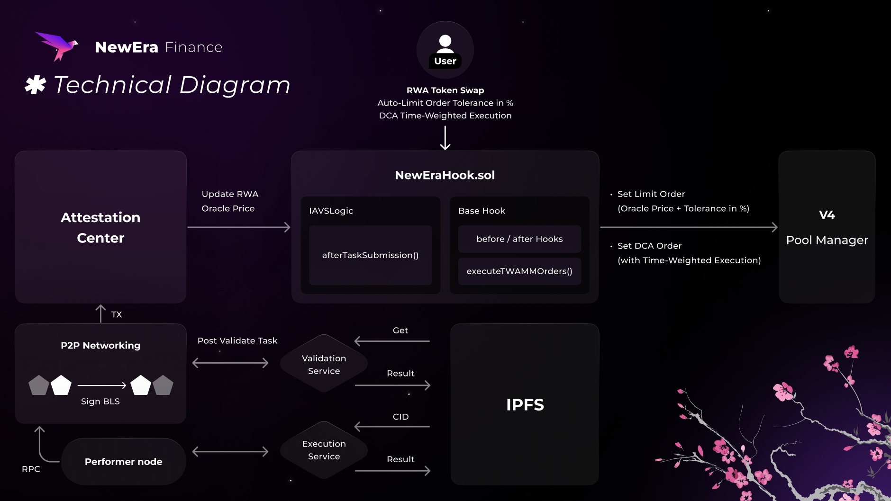

# NewEra Finance

#### Smart Hook for Real World Assets with automatic DCA execution and oracle-based limit orders.

## Links

- **GitHub:** https://github.com/julian-newera/new-era-hookathon
- **Presentation:** https://docsend.com/view/vrtj2tbaas54sbz5

## Introduction

NewEra Finance enables users to automatically invest in a self-selected portfolio of Real World Assets (RWAs) featuring Dollar Cost Average (DCA) and oracle-based Limit Orders. Making investing into RWA a habit instead of a hassle.

Users can set DCA scheduled trades on a self-selected portfolio of RWA’s. To ensure optimized price even during low liquidity markets, the Hook sets limit orders via price oracles aligned to underlying RWA issuance/redemption price. This concept is similar to Slippage. The User can set a tolerance level in how much premium he is prepared to pay over the underlying asset value. The higher the tolerance the faster the execution as the position is more attractive for arbitrage. The logic of the Auto-Limit Order goes as followed:

- If pool price ≤ oracle price + tolerance: Execute swap normally.
- If pool price > oracle price + tolerance: Create limit order at oracle price + tolerance.

The Hook leverages Uniswap V4 Hooks, TWAMM & Limit Order Logic and Eigenlayer AVS to enable these automations. The User is in full control over these automations and can enable / disable them via the UI.

How do financial instruments benefit Web3 & NewEra Finance?

Compared to Web2 Brokers the Users investments are non-custodial, worldwide transferable and 24/7 tradable. Giving them full control over their assets and reducing the counter party risk to a minimal.

NewEra Finance offers RWAs across all categories of Commodities, US Bonds, Global Bonds, Stocks & ETFs. These assets are fractionalized own-able & globally accessibility.

## Technical Overview

- TWAMM (Time-Weighted Average Market Making) for DCA with execution schedules.
- Limit Order functionality with Eigenlayer AVS price oracle Integration.
- Multi-Token Selection & Swap via the Frontend.

### Architecture Diagram



## Smart Hook Logic
This approach ensures users receive fair pricing even in low-liquidity markets by:
1. Comparing the current market price against the oracle-provided actual price
2. Setting a user-defined tolerance level for price deviation
3. Executing immediately when prices is in range of the tolerance.
4. Creating a limit order at the maximum acceptable price when the current prices exceed the tolerance.

## Technical Implementation
``` 

new-era-hookathon/
├── contracts/
│   ├── foundry.toml
│   ├── remappings.txt
│   ├── src/
│   │   ├── NewEraHook.sol
│   │   ├── interfaces/
│   │   ├── libraries/
│   │   └── types/
│   └── test/
│
├── frontend/
│   ├── public/
│   ├── src/
│   │   ├── abis/
│   │   ├── assets/
│   │   ├── components/
│   │   ├── connection/
│   │   ├── constants/
│   │   ├── featureFlags/
│   │   ├── graphql/
│   │   ├── hooks/
│   │   └── lib/
│   └── package.json
│
├── services/
│   ├── Execution_Service/
│   │   ├── config/
│   │   ├── src/
│   │   ├── Dockerfile
│   │   ├── index.js
│   │   └── package.json
│   │
│   └── Validation_Service/
│       ├── config/
│       ├── src/
│       ├── Dockerfile
│       ├── index.js
│       └── package.json
│
├── infrastructure/
│   ├── build/
│   ├── grafana/
│   ├── docker-compose.yml
│   └── prometheus.yaml
│
├── LICENSE
├── package.json
└── README.md

```

### Key Components:

```LoremIpsum.sol ``` xxxx

```LoremIpsum.sol ``` xxxx

### Limit Order Contract Details

Our implementation extends BaseHook and incorporates several key features:

- **EpochLibrary**: Implements epoch-based order tracking and lifecycle management
- **Hook Permissions**: Configured for `afterInitialize` and `afterSwap` operations
- **Order Lifecycle Management**: 
  - `place()`: Create new limit orders with specified parameters
  - `kill()`: Cancel existing orders and return funds
  - `withdraw()`: Claim filled order proceeds
  - `_fillEpoch()`: Internal function to process orders when conditions are met

### TWAMM Integration

The Time-Weighted Average Market Making (TWAMM) functionality:
- Enables automated Dollar Cost Average (DCA) investment strategies
- Splits larger orders into smaller portions executed over time
- Reduces price impact and slippage for users
- Provides execution schedules configurable via the UI

### Oracle Integration

Our Smart Hook integrates with Eigenlayer AVS to:
- Access reliable price oracle data for RWAs
- Compare on-chain liquidity pool prices against oracle prices
- Ensure trading occurs within acceptable tolerance of underlying asset values
- Set limit orders automatically when market prices exceed tolerance levels


### Intefaces:

##### Lorem Isum

##### Lorem Isum

##### Lorem Isum

### Example Usage:


## Development Setup

To set up the development environment:

1. Clone the repository
```bash
# Clone the repository
git clone https://github.com/julian-newera/new-era-hookathon.git
cd new-era-hookathon/contracts

# Install dependencies
forge install

# Run all tests
forge test -vvv
